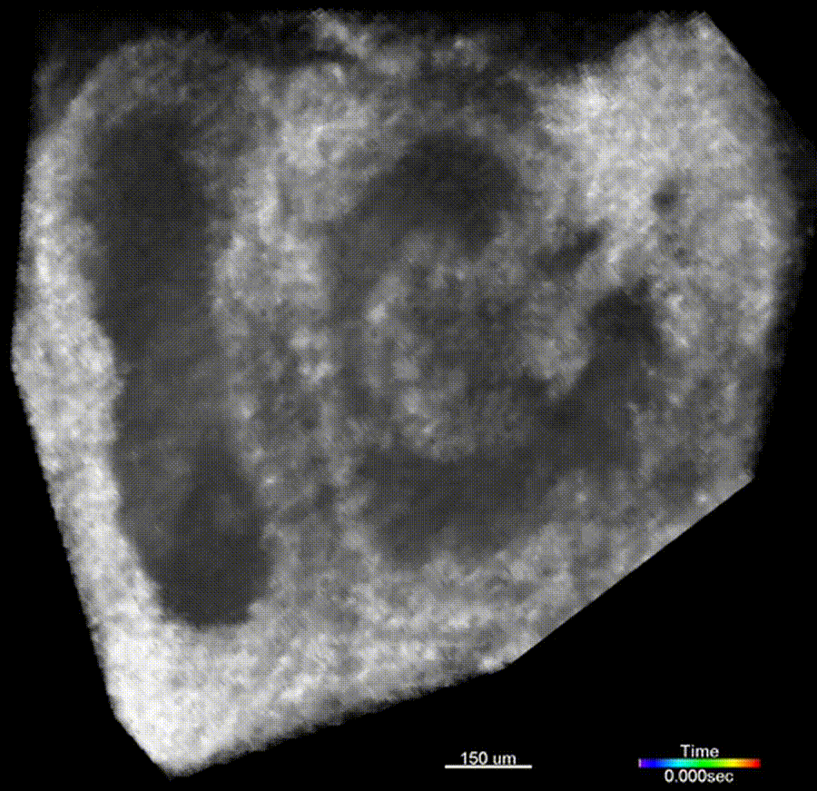
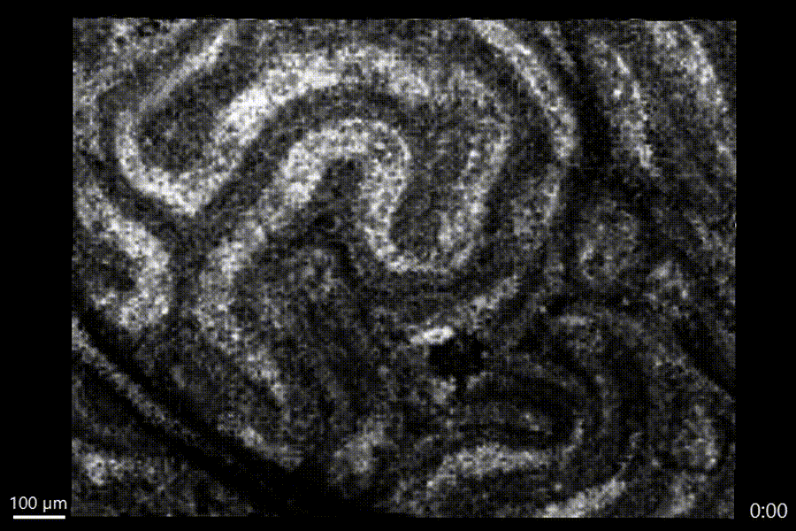
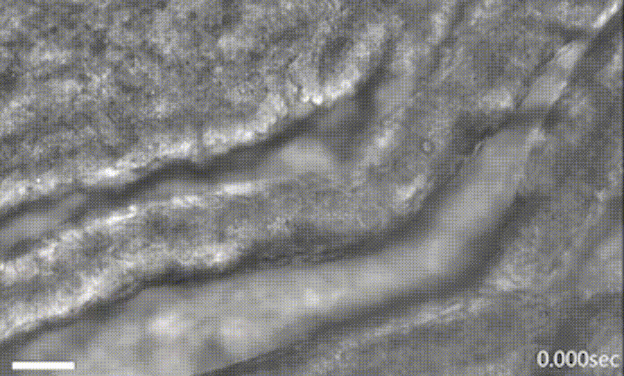

<h2 align="center"><strong>Welcome to the GitHub page of:</strong></h2>

	

We are working on the interface of developmental and reproductive biology, optical engineering, and computational modeling and analysis to understand mechanisms regulating normal and abnormal developmental processes. Our approaches combine live embryo manipulation protocols, mouse models of congenital defects, state-of-the-art functional optical coherence tomography technology, confocal microscopy and advanced computational analysis. Through development of innovative optical imaging methods and using them in mouse models of human disorders, we study dynamic functional aspects of these disorders.

    

<small>Figure descriptions, in order from left to right, top to bottom: (1) 4D Doppler OCT hemodynamic imaging of E9.0 mouse embryonic heart showing blood flow dynamics, from Wang S et al., J Biophotonics 2016 (2) Bi-directional movement of preimplantation embryos in the isthmus of mouse oviduct <em>in vivo</em> with OCT imaging, from Wang S and Larina I, Cell Reports 2021 (3) Visualization of cilia metachronal wave propagation in the mouse oviduct ex vivo, from Xia T et al., Optica 2023 (4) Luminal wave propagation along mouse caput epididymal duct <em>in vivo</em>, from Umezu K et al., Biol. of Repr. 2023 (5) Brightfield microscopy videos showing intensity fluctuations from cilia in mouse oviduct, from Scully D et al. Biol. of Repr. 2025</small>

## Check out our available code and their related publications:
[Cilia beat frequency mapping](https://github.com/LarinaLab/cilia-beat-frequency) (Wang S et al., Scientific Reports 2015)

[Cilia metachronal wave analysis](https://github.com/LarinaLab/CBF-CMW) (Xia T et al., Optica 2023)

Can't find what you're looking for? Additional resources may be requested from larina@bcm.edu